# Trip Planner — System Architecture

## High-Level Overview

```
User Request
    │
    ▼
FastAPI (POST /trips)
    │  returns session_id immediately (202 Accepted)
    │  launches LangGraph pipeline as background task
    ▼
LangGraph Orchestrator  ◄──────────────────────────────────────┐
    │                                                           │
    │  Phase 0 ── Input Guardrail Node                         │
    │  Phase 1 ── User Input Agent (parse + validate)          │
    │  Phase 2 ── Memory Agent (ChromaDB vector lookup)        │
    │  Phase 3 ── Parallel Research (weather/transport/hotel/places)
    │  Phase 4 ── Conflict-driven retries                      │
    │  Phase 5 ── Budget Agent (deterministic)                 │
    │  Phase 6 ── Itinerary Agent                              │
    │  Phase 7 ── Final Review Agent                           │
    │  Phase 8 ── PDF Generator                                │
    └─────── every node returns to orchestrator ───────────────┘
```

---

## Full Component Diagram (Mermaid)

```mermaid
flowchart TD
    USER(["User\n(raw_input)"])
    API["FastAPI\nPOST /trips\n202 Accepted → session_id"]
    BGND(["Background Task"])

    USER -->|HTTP POST| API
    API -->|spawn| BGND
    BGND --> ORCH

    subgraph LANGGRAPH["LangGraph Pipeline (Hub-and-Spoke)"]
        direction TB

        ORCH["Orchestrator Router\n(pure deterministic routing)"]

        ORCH -->|"Phase 0\n(no guardrail_result)"| GRD
        ORCH -->|"Phase 1\n(no trip_preferences)"| UIA
        ORCH -->|"Phase 2\n(no user_profile)"| MEM
        ORCH -->|"Phase 3\n(Send API — parallel)"| PAR
        ORCH -->|"Phase 5\n(no budget_summary)"| BGT
        ORCH -->|"Phase 6\n(no itinerary)"| ITN
        ORCH -->|"Phase 7\n(no review_status)"| REV
        ORCH -->|"Phase 8\n(pdf not generated)"| PDF
        ORCH -->|"guardrail blocked"| BLOCKED(["END\n(blocked)"])
        ORCH -->|"all phases done"| DONE(["END\n(success)"])

        GRD["Input Guardrail Node\n───────────────────\n1. Deterministic length/charset check\n2. PII detection + logging\n3. LLM safety + injection check"]

        UIA["User Input Agent\n───────────────────\nPII mask → GPT-4o-mini\n→ TripPreferences\n→ Deterministic validation\n→ PII restore in location fields"]

        MEM["Memory Agent\n───────────────────\nChromaDB vector search\n→ user_profile\n(past trips + inferred prefs)"]

        subgraph PAR["Parallel Research Fan-out (Send API)"]
            WEA["Weather Agent\nOpenWeatherMap API\n→ mock fallback on timeout"]
            TRN["Transport Agent\nSearchFallback(Tavily)\n→ LLMFallback(GPT-4o-mini → GPT-3.5)\n→ AgentFallback on total failure"]
            HTL["Hotel Agent\nSearchFallback(Tavily)\n→ LLMFallback(GPT-4o-mini → GPT-3.5)\n→ AgentFallback on total failure"]
            PLC["Places Agent\nSearchFallback×3(Tavily)\n→ LLMFallback(GPT-4o-mini → GPT-3.5)\n→ AgentFallback on total failure"]
        end

        BGT["Budget Agent\n───────────────────\nPure deterministic math\n(no LLM — fast, zero cost)\n+ DeterministicGuardrails\n(budget allocation check)"]

        ITN["Itinerary Agent\n───────────────────\nGPT-4o-mini (temp=0.3)\n+ DeterministicGuardrails\n(day count + empty-day check)"]

        REV["Final Review Agent\n───────────────────\nGPT-4o-mini structured output\n→ approved + retry_reasons\n(triggers Phase 4 retries)"]

        PDF["PDF Generator Agent\n───────────────────\nReportLab PDF creation\n→ store trip in ChromaDB\n→ SQLite status update"]

        GRD --> ORCH
        UIA --> ORCH
        MEM --> ORCH
        WEA --> ORCH
        TRN --> ORCH
        HTL --> ORCH
        PLC --> ORCH
        BGT --> ORCH
        ITN --> ORCH
        REV --> ORCH
        PDF --> ORCH
    end

    subgraph GUARDRAILS["Guardrail Layer (src/guardrails.py)"]
        DG["DeterministicGuardrails\n────────────────────────\n• validate_raw_input()\n  length / charset / empty\n• validate_trip_preferences()\n  dates / budget / travelers\n• validate_budget_allocation()\n  hotel ≤70%, transport ≤50%\n• validate_itinerary()\n  day count / empty days"]
        IG["InputGuardrails (LLM)\n────────────────────────\n• is_safe (harmful content)\n• is_travel_related (topic)\n• has_prompt_injection\n→ severity: pass/warn/block\n→ fail-open on LLM errors"]
        PII["PIIHandler\n────────────────────────\nPatterns: EMAIL, PHONE,\nSSN, CREDIT_CARD,\nPASSPORT, AADHAAR\n• detect_pii()\n• mask_pii() → tokens\n• restore_pii()\n• sanitize_for_storage()"]
    end

    subgraph FALLBACKS["Fallback Layer (src/fallbacks.py)"]
        LF["LLMFallback\n────────────────────────\ncall_with_fallback(\n  primary: GPT-4o-mini,\n  fallback: GPT-3.5-turbo\n)\n• 2 retries + exp back-off\n• switches model on exhaustion"]
        SF["SearchFallback\n────────────────────────\nsearch(query, fn,\n  timeout=25s,\n  context)\n• asyncio timeout wrapper\n• returns mock string on\n  timeout or any error"]
        AF["AgentFallback\n────────────────────────\ndefault_transport(prefs)\ndefault_hotel(prefs)\ndefault_places(prefs)\ndefault_weather(prefs)\n→ budget-derived estimates\n→ used in except blocks"]
    end

    subgraph PERSISTENCE["Persistence Layer"]
        CHROMA[("ChromaDB\nVector Store\n(user memory)")]
        SQLITE[("SQLite\nSession Store\n(trip_history.db)")]
        PDFDIR[("PDF Files\n./outputs/")]
    end

    subgraph RETRIEVAL["Query Endpoints"]
        S1["GET /trips/{id}/status\n→ polls SQLite"]
        S2["GET /trips/{id}/pdf\n→ file download"]
        S3["GET /users/{id}/trips\n→ trip history"]
        S4["GET /health"]
    end

    GRD -.->|uses| DG
    GRD -.->|uses| IG
    GRD -.->|uses| PII
    UIA -.->|uses| PII
    UIA -.->|uses| DG
    BGT -.->|uses| DG
    ITN -.->|uses| DG
    TRN -.->|uses| LF
    TRN -.->|uses| SF
    TRN -.->|uses| AF
    HTL -.->|uses| LF
    HTL -.->|uses| SF
    HTL -.->|uses| AF
    PLC -.->|uses| LF
    PLC -.->|uses| SF
    PLC -.->|uses| AF

    MEM <-->|"retrieve_user_profile()\nstore_trip_result()"| CHROMA
    PDF -->|store completed trip| CHROMA
    PDF -->|write PDF| PDFDIR
    BGND -->|streaming updates via astream| SQLITE

    USER -->|HTTP GET| S1
    USER -->|HTTP GET| S2
    USER -->|HTTP GET| S3
    S1 --> SQLITE
    S2 --> PDFDIR
    S3 --> SQLITE
```



---

## Data Flow Summary

```
raw_input (natural language)
    │
    ├─[Phase 0]─ Input Guardrail
    │              ├── Deterministic: length / charset / empty
    │              ├── PII detection: mask before LLM calls, log types
    │              └── LLM safety: harmful / off-topic / injection → block or pass
    │
    ├─[Phase 1]─ User Input Agent
    │              ├── PII masked input → GPT-4o-mini → TripPreferences (Pydantic)
    │              ├── Deterministic validation (dates, budget, travelers)
    │              └── PII restored in location fields
    │
    ├─[Phase 2]─ Memory Agent
    │              └── ChromaDB semantic search → user_profile
    │
    ├─[Phase 3]─ Parallel Research (Send API fan-out)
    │              ├── Weather: OpenWeatherMap API  →  mock fallback on timeout
    │              ├── Transport: Tavily → LLM parse →  GPT fallback → AgentFallback
    │              ├── Hotel:    Tavily → LLM parse →  GPT fallback → AgentFallback
    │              └── Places:   Tavily×3 → LLM parse → GPT fallback → AgentFallback
    │
    ├─[Phase 4]─ Conflict retries (orchestrator rules):
    │              hotel > 60% budget → retry hotel_agent
    │              transport unavailable → retry transport_agent
    │              severe weather + no indoor → retry places_agent
    │
    ├─[Phase 5]─ Budget Agent (pure deterministic math, no LLM)
    │              └── Deterministic guardrail: allocation ratios check
    │
    ├─[Phase 6]─ Itinerary Agent
    │              ├── GPT-4o-mini structured output (Itinerary)
    │              └── Deterministic guardrail: day count, empty-day check
    │
    ├─[Phase 7]─ Final Review Agent
    │              └── GPT-4o-mini → approved + retry_reasons → Phase 4 retries
    │
    └─[Phase 8]─ PDF Generator
                   ├── ReportLab PDF (6+ sections)
                   ├── Store trip in ChromaDB for future memory
                   └── SQLite status = complete
```

---

## Guardrail Decision Tree

```
raw_input received
    │
    ├── DeterministicGuardrails.validate_raw_input()
    │       empty / too short / too long / no alpha → BLOCK
    │
    ├── PIIHandler.detect_pii()
    │       PII found → LOG + WARN (never block alone)
    │
    └── InputGuardrails.check()  [LLM call — fail-open]
            is_safe=False        → BLOCK (severity=block)
            has_prompt_injection → BLOCK (severity=block)
            not is_travel_related→ BLOCK (severity=warn)
            all clear            → PASS  (severity=pass or warn if PII)

After TripPreferences parsed:
    └── DeterministicGuardrails.validate_trip_preferences()
            past date / end≤start / >60 days → BLOCK
            budget < $50 / travelers out of 1-20 → BLOCK
            budget > $500k → WARN

After budget_agent:
    └── DeterministicGuardrails.validate_budget_allocation()
            hotel > 70% / transport > 50% / total > 110% → WARN

After itinerary_agent:
    └── DeterministicGuardrails.validate_itinerary()
            no days → BLOCK
            day count mismatch → WARN
            empty days → WARN
```

---

## Fallback Cascade

```
For each LLM call (transport / hotel / places / itinerary):
    1. Primary: GPT-4o-mini   (timeout=45s, up to 2 attempts)
       │  success → use result
       │  failure → wait 1-2s and retry
       └── exhausted → switch to fallback model
    2. Fallback: GPT-3.5-turbo (timeout=30s, 1 attempt)
       │  success → use result
       └── failure → raise RuntimeError

For each Tavily search (transport / hotel / places):
    1. Tavily API call         (timeout=25s)
       │  success → use result
       │  timeout/error → return context-specific mock string
       └── mock enables LLM parsing to still produce a result

If entire agent node raises an exception (both LLM and search fail):
    → AgentFallback.default_xxx(prefs)
      budget-derived estimates, within_budget=True
      clearly marked "fallback estimate" in notes field
```

---

## PII Flow

```
User types: "I'm John. Book me a trip to Paris, budget $3000. Email: john@example.com"
                                                                           ↑
                                                              PIIHandler detects PII_EMAIL

1. PIIHandler.mask_pii(raw_input)
   → masked:  "I'm John. Book me a trip to Paris, budget $3000. Email: [PII_EMAIL_1]"
   → mapping: {"[PII_EMAIL_1]": "john@example.com"}
   → PII types logged to application logs

2. Masked text sent to GPT-4o-mini (no real email in API call)

3. After parsing, PIIHandler.restore_pii(destination, mapping)
   → Location fields get original values back if they accidentally contained PII tokens

4. PIIHandler.sanitize_for_storage(state)
   → Before writing to SQLite / logs, all string fields are masked
   → Stored records contain [PII_EMAIL_1] tokens, not real email addresses
```

---

## Tech Stack

| Layer              | Technology                              |
|--------------------|-----------------------------------------|
| Orchestration      | LangGraph (StateGraph, hub-and-spoke)   |
| LLM                | GPT-4o-mini (primary) / GPT-3.5-turbo (fallback) |
| Web search         | Tavily API                              |
| Weather            | OpenWeatherMap API                      |
| Vector memory      | ChromaDB + text-embedding-3-small       |
| Session storage    | SQLite + SQLAlchemy (async)             |
| PDF generation     | ReportLab                               |
| API framework      | FastAPI                                 |
| Guardrails         | Custom (deterministic + LLM-based)      |
| PII handling       | Regex-based detection + token masking   |
| Fallbacks          | LLM model swap + search mock + agent defaults |
